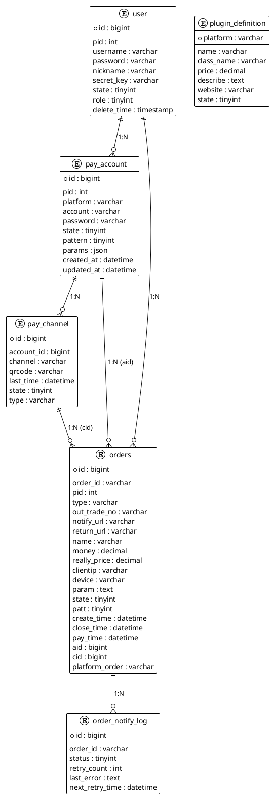

# Easy-Pay 项目设计文档

> **文档版本**: 1.0.0
> **项目版本**: 0.2.0-SNAPSHOT
> **最后更新**: 2025-11-25

---

## 目录

1. [项目概述](#一项目概述)
2. [系统架构](#二系统架构)
3. [数据库设计](#三数据库设计)
4. [核心模块说明](#四核心模块说明)
5. [事件机制](#五事件机制)
6. [工程规范](#六工程规范)
7. [遗留系统参考](#七遗留系统参考)

---

## 一、项目概述

### 1.1 项目定位

Easy-Pay (mpay) 是一个**支付聚合系统**，核心功能包括：

1. 商户通过 API 创建支付订单
2. 系统分配支付通道（微信/支付宝收款码）
3. 监听服务检测支付完成
4. 异步通知商户
5. 管理后台查看订单和统计

### 1.2 技术栈

| 层级 | 技术选型 |
|------|----------|
| 后端框架 | Spring Boot 3.3.4 + Java 21 |
| 数据库 | MySQL 9.5 |
| 缓存/消息 | Redis 8.4 (Stream) |
| 前端框架 | Vue 3 + TypeScript + Vite |
| UI 组件库 | Element Plus |
| 状态管理 | Pinia |
| 构建工具 | Maven (后端) / Vite (前端) |
| 容器化 | Docker Compose |

### 1.3 架构演变说明

**原始规划**：微���务架构
```
预期模块:
  - mpay-gateway (网关)
  - mpay-auth (认证)
  - mpay-payment (支付)
  - mpay-merchant (商户)
  - mpay-plugin (插件)
  - mpay-monitor (监听)
  - mpay-bff-console (BFF)
```

**当前实现**：单体架构
- 单一 Spring Boot 应用
- 所有模块整合在一个 JAR 包中
- 按包 (package) 划分功能模块

> **说明**：在订单量不大时保持单体架构，后续可按领域拆分为微服务。

---

## 二、系统架构

### 2.1 整体架构图

```
┌─────────────────────────────────────────────────────────────────────┐
│                          客户端层                                    │
├─────────────────────┬───────────────────────────────────────────────┤
│   Console (Vue 3)   │              Cashier (Vue 3)                  │
│   管理后台 :5173    │              收银台 :5174                      │
└─────────┬───────────┴───────────────────┬───────────────────────────┘
          │                               │
          │ HTTP/JSON                     │ HTTP/JSON
          ▼                               ▼
┌─────────────────────────────────────────────────────────────────────┐
│                       后端服务 (Spring Boot :8080)                   │
├─────────────────────────────────────────────────────────────────────┤
│  ┌──────────────┐  ┌──────────────┐  ┌──────────────┐              │
│  │   Auth       │  │   Payment    │  │   Account    │              │
│  │   认证模块   │  │   支付模块   │  │   账号模块   │              │
│  └──────────────┘  └──────────────┘  └──────────────┘              │
│  ┌──────────────┐  ┌──────────────┐  ┌──────────────┐              │
│  │   Plugin     │  │   Monitor    │  │   Statistics │              │
│  │   插件模块   │  │   监听模块   │  │   统计模块   │              │
│  └──────────────┘  └──────────────┘  └──────────────┘              │
├─────────────────────────────────────────────────────────────────────┤
│                       Common (通用组件层)                            │
│  ApiResponse | BusinessException | GlobalExceptionHandler           │
└─────────────────────────────────────────────────────────────────────┘
          │                               │
          ▼                               ▼
┌─────────────────────┐         ┌─────────────────────┐
│   MySQL :3307       │         │   Redis :6380       │
│   数据持久化         │         │   缓存/消息队列      │
└─────────────────────┘         └─────────────────────┘
```

### 2.2 后端包结构

```
com.github.nonfou.mpay
├── MpayApplication.java          # Spring Boot 启动类
├── common/                        # 通用基础组件
│   ├── error/                     # 异常体系
│   │   ├── BusinessException.java
│   │   └── ErrorCode.java
│   ├── response/                  # 统一响应封装
│   │   ├── ApiResponse.java
│   │   ├── ErrorDetail.java
│   │   └── PageResponse.java
│   └── web/                       # Web 配置
│       └── GlobalExceptionHandler.java
├── controller/                    # 控制器层 (14个)
├── dto/                           # 数据传输对象 (29个)
├── entity/                        # 实体类 (6个)
├── repository/                    # 数据访问层 (6个)
├── service/                       # 服务层 (18个接口)
│   └── impl/                      # 实现类
├── security/                      # 安全模块 (8个)
├── signature/                     # 签名验证
├── event/                         # 事件模块
├── notify/                        # 通知模块
└── support/                       # 支持工具
```

### 2.3 前端结构

#### Console 管理后台

```
frontend/console/
├── src/
│   ├── views/                    # 页面组件
│   │   ├── LoginView.vue         # 登录页
│   │   ├── DashboardView.vue     # 仪表盘
│   │   ├── OrderListView.vue     # 订单管理
│   │   ├── AccountListView.vue   # 账号管理
│   │   ├── PluginListView.vue    # 插件管理
│   │   ├── UserListView.vue      # 用户管理
│   │   └── TestPayView.vue       # 测试支付
│   ├── layouts/                  # 布局组件
│   ├── router/                   # 路由配置
│   ├── stores/                   # Pinia 状态管理
│   ├── services/                 # API 服务封装
│   └── types/                    # TypeScript 类型
└── vite.config.ts
```

#### Cashier 收银台

```
frontend/cashier/
├── src/
│   ├── views/
│   │   ├── HomeView.vue          # 首页
│   │   ├── PayView.vue           # 支付页面
│   │   ├── ResultView.vue        # 支付结果
│   │   └── NotFoundView.vue      # 404
│   ├── router/
│   ├── services/
│   └── types/
└── vite.config.ts
```

---

## 三、数据库设计

### 3.1 ER 关系图

```
user (1) ──< pay_account (1) ──< pay_channel
   │                     │
   └──< orders >── pay_channel (many-to-one)
```

关系说明：
- `orders.pid` → `user.pid` (逻辑外键)
- `orders.aid` → `pay_account.id`
- `orders.cid` → `pay_channel.id`
- `pay_channel.account_id` → `pay_account.id`

### 3.2 数据表结构

#### 3.2.1 user 表（商户/用户）

| 字段 | 类型 | 说明 |
|------|------|------|
| `id` | bigint | 自增主键 |
| `pid` | int | 商户编号，业务唯一键 |
| `username` | varchar | 登录账号 |
| `password` | varchar | BCrypt 加密密码 |
| `nickname` | varchar | 昵称 |
| `email` | varchar | 邮箱 |
| `secret_key` | varchar | API 签名密钥 |
| `state` | tinyint | 启用状态 (0-禁用, 1-启用) |
| `role` | tinyint | 角色 (0-普通用户, 1-管理员) |
| `delete_time` | timestamp | 软删字段 |

#### 3.2.2 orders 表

| 字段 | 类型 | 说明 |
|------|------|------|
| `id` | bigint | 主键 |
| `order_id` | varchar | 平台订单号 (H+日期+随机) |
| `pid` | int | 商户编号 |
| `type` | varchar | 支付方式 (wxpay/alipay) |
| `out_trade_no` | varchar | 商户订单号 |
| `notify_url` | varchar | 异步回调地址 |
| `return_url` | varchar | 成功跳转地址 |
| `name` | varchar | 商品名称 |
| `money` | decimal(10,2) | 下单金额 |
| `really_price` | decimal(10,2) | 实际匹配金额（防碰撞） |
| `clientip` | varchar | 客户端 IP |
| `device` | varchar | 设备类型 |
| `param` | text | 扩展参数 |
| `state` | tinyint | 0=待支付, 1=已支付, 2=已关闭 |
| `patt` | tinyint | 监听模式 |
| `create_time` | datetime | 下单时间 |
| `close_time` | datetime | 订单过期时间 |
| `pay_time` | datetime | 支付时间 |
| `aid` | bigint | 收款账号 ID |
| `cid` | bigint | 收款通道 ID |
| `platform_order` | varchar | 第三方流水号 |

#### 3.2.3 pay_account 表

| 字段 | 类型 | 说明 |
|------|------|------|
| `id` | bigint | 主键 |
| `pid` | int | 所属商户 |
| `platform` | varchar | 插件平台标识 (wxpay/alipay) |
| `account` | varchar | 登录账号 |
| `password` | varchar | 密码/密钥 |
| `state` | tinyint | 启用状态 |
| `pattern` | tinyint | 监听模式 (0=单次, 1=连续) |
| `params` | json | 自定义参数 |
| `created_at` | datetime | 创建时间 |
| `updated_at` | datetime | 更新时间 |

#### 3.2.4 pay_channel 表

| 字段 | 类型 | 说明 |
|------|------|------|
| `id` | bigint | 主键 |
| `account_id` | bigint | 关联 pay_account.id |
| `channel` | varchar | 终端编号 |
| `qrcode` | varchar | 二维码 URL |
| `last_time` | datetime | 上次使用时间 |
| `state` | tinyint | 启用状态 |
| `type` | varchar | 码类型 |

#### 3.2.5 order_notify_log 表

| 字段 | 类型 | 说明 |
|------|------|------|
| `id` | bigint | 主键 |
| `order_id` | varchar | 订单号 |
| `status` | tinyint | 通知状态 (0-待通知, 1-成功, 2-失败) |
| `retry_count` | int | 重试次数 |
| `last_error` | text | 最后错误信息 |
| `next_retry_time` | datetime | 下次重试时间 |

#### 3.2.6 plugin_definition 表

| 字段 | 类型 | 说明 |
|------|------|------|
| `platform` | varchar | 平台标识 (主键) |
| `name` | varchar | 插件名称 |
| `class_name` | varchar | 类名 |
| `price` | decimal | 价格 |
| `describe` | text | 描述 |
| `website` | varchar | 官网 |
| `state` | tinyint | 状态 |
| `install` | tinyint | 安装状态 |
| `query` | json | 查询配置 |
| `version` | varchar | 版本 |

### 3.3 索引建议

为高频查询字段添加索引：
- `orders`: `(pid, state, create_time)` 复合索引
- `orders`: `order_id` 唯一索引
- `orders`: `out_trade_no` 索引
- `pay_account`: `(pid, platform)` 复合索引
- `pay_channel`: `account_id` 索引

---

## 四、核心模块说明

### 4.1 认证模块 (Auth)

**职责**：
- 提供后台/商户登录、登出、刷新令牌能力
- 基于 JWT 的身份认证
- 角色权限控制 (RBAC)

**核心组件**：
- `SecurityConfig`: 安全配置，定义接口权限
- `JwtTokenProvider`: JWT 令牌生成与验证
- `JwtAuthenticationFilter`: JWT 认证过滤器
- `SecurityUtils`: 安全工具类（获取当前用户）

**接口列表**：
| 接口 | 方法 | 说明 |
|------|------|------|
| `/api/auth/login` | POST | 用户登录 |
| `/api/auth/refresh` | POST | 刷新令牌 |
| `/api/auth/current` | GET | 获取当前用户 |

**JWT 配置**：
- Access Token 有效期：1 小时
- Refresh Token 有效期：7 天
- 密钥：从环境变量 `JWT_SECRET` 读取

### 4.2 支付模块 (Payment)

**职责**：
- 负责公共下单接口（对应旧版 `submit`/`mapi`）
- 收银台数据查询
- 订单聚合逻辑：通道选择、金额去重、通知触发

**核心流程**：

```
1. createOrder (创建订单)
   ├── 校验商户签名
   ├── 选择可用通道 (ChannelSelector)
   ├── 金额去重 (PriceAllocator)
   ├── 持久化订单
   ├── 发布订单创建事件
   └── 返回收银台地址

2. 收银台/订单状态
   ├── GET /api/cashier/orders/{orderId} - 获取订单详情
   └── GET /api/cashier/orders/{orderId}/state - 轮询支付状态
```

**核心组件**：
- `PublicOrderService`: 公共订单服务
- `CashierService`: 收银台服务
- `ChannelSelector`: 通道选择器
- `PriceAllocator`: 金额分配器（+0.01 步进去重）

**接口列表**：
| 接口 | 方法 | 说明 |
|------|------|------|
| `/api/public/orders/create` | POST | 创建订单 |
| `/api/public/orders/{orderId}` | GET | 查询订单 |
| `/api/cashier/orders/{orderId}` | GET | 收银台订单详情 |
| `/api/cashier/orders/{orderId}/state` | GET | 订单状态轮询 |

### 4.3 账号管理模块 (Account)

**职责**：
- 管理商户的收款账号与二维码终端
- 账号/终端 CRUD、启停、批量删除
- 二维码上传、交易记录查询

**核心组件**：
- `AccountService`: 账号管理服务
- `PayAccountEntity`: 支付账号实体
- `PayChannelEntity`: 支付通道实体

**接口列表**：
| 接口 | 方法 | 说明 |
|------|------|------|
| `/api/console/accounts` | GET | 账号列表 |
| `/api/console/accounts` | POST | 创建账号 |
| `/api/console/accounts/{id}` | PUT | 更新账号 |
| `/api/console/accounts/{id}/state` | PATCH | 启停账号 |
| `/api/console/accounts/{id}/channels` | GET | 通道列表 |
| `/api/console/accounts/{id}/channels` | POST | 创建通道 |

### 4.4 插件模块 (Plugin)

**职责**：
- 管理支付插件元数据与本地安装状态
- 同步远程插件市场信息
- 启停插件、卸载插件、维护查询参数

**核心组件**：
- `PluginService`: 插件管理服务
- `PluginEntity`: 插件定义实体

**接口列表**：
| 接口 | 方法 | 说明 |
|------|------|------|
| `/api/console/plugins` | GET | 插件列表 |
| `/api/console/plugins` | POST | 新增/更新插件 |
| `/api/console/plugins/{platform}/state` | PATCH | 启用/停用 |
| `/api/console/plugins/{platform}` | DELETE | 卸载 |
| `/api/console/plugins/sync` | POST | 同步远程市场 |

### 4.5 监听模块 (Monitor)

**职责**：
- 取代旧版 `runtime/order.json` 轮询机制
- 订单监听、收款记录匹配、通知触发
- 订阅订单创建事件，将活跃订单写入 Redis Stream

**核心组件**：
- `OrderHeartbeatService`: 订单心跳服务（发布/拉取活跃订单）
- `PaymentMatchService`: 支付匹配服务
- `OrderMatchService`: 订单匹配服务

**接口列表**：
| 接口 | 方法 | 说明 |
|------|------|------|
| `/api/listen/heartbeat/{aid}` | POST | 上报心跳 |
| `/api/listen/payment` | POST | 上报支付记录 |
| `/api/internal/orders/match` | POST | 订单匹配（内部） |

### 4.6 统计模块 (Statistics)

**职责**：
- 提供仪表盘数据聚合
- 收入统计、支付类型分布、订单趋势

**核心组件**：
- `StatisticsService`: 统计服务

**接口列表**：
| 接口 | 方法 | 说明 |
|------|------|------|
| `/api/console/statistics/revenue` | GET | 收入统计 |
| `/api/console/statistics/payment-types` | GET | 支付类型分布 |
| `/api/console/statistics/trends` | GET | 订单趋势 |

### 4.7 通用组件 (Common)

**职责**：
- 提供各模块复用的基础能力
- 统一响应封装、异常处理、错误码定义

**核心组件**：

| 组件 | 说明 |
|------|------|
| `ApiResponse` | 统一 API 响应封装 |
| `PageResponse` | 分页响应封装 |
| `ErrorCode` | 错误码枚举 |
| `BusinessException` | 业务异常 |
| `GlobalExceptionHandler` | 全局异常处理器 |
---

## 五、事件机制

### 5.1 Redis Stream 订单心跳

为替换旧版 `order.json` 文件轮询，系统采用 Redis Stream 传递订单监听事件：

```
┌──────────────┐     订单创建     ┌──────────────────┐
│   Payment    │ ──────────────► │  Redis Stream    │
│   Service    │                 │ mpay:order:      │
└──────────────┘                 │ heartbeat        │
                                 └────────┬─────────┘
                                          │
                                          ▼
                                 ┌──────────────────┐
                                 │  监听客户端       │
                                 │  (外部程序)      │
                                 └────────┬─────────┘
                                          │
              收款记录                     │
┌──────────────┐ ◄─────────────────────────┘
│   Monitor    │
│   Service    │
└──────┬───────┘
       │ 匹配成功
       ▼
┌──────────────┐
│   Payment    │ → 更新订单状态 → 通知商户
│   Service    │
└──────────────┘
```

### 5.2 Stream 字段定义

| 字段 | 说明 |
|------|------|
| `orderId` | 平台订单号 |
| `pid` | 商户 ID |
| `aid` | 账号 ID |
| `cid` | 通道 ID |
| `type` | 支付方式 |
| `expiresAt` | 订单过期时间 |
| `pattern` | 监听模式 (0/1) |

### 5.3 监听器 API

**获取活跃订单**：
```http
GET /api/listen/orders/active?pid=1000
```

**上报支付记录**：
```http
POST /api/listen/payment
Content-Type: application/json

{
  "pid": 1000,
  "aid": 1,
  "payway": "wxpay",
  "channel": "wxpay1#1001",
  "price": 10.0,
  "platformOrder": "wx123",
  "rawPayload": "{...}"
}
```

### 5.4 接口鉴权（待完善）

- 监听客户端调用接口时需携带签名参数：`timestamp`、`nonce`、`signature`
- 服务端根据商户密钥验证签名
- 后续可扩展为 HMAC-SHA256 签名或 Bearer Token

### 5.5 失败重试策略

- 若上报收款记录后接收到非 2xx 响应，监听客户端应按指数退避策略重试
- 设置最大重试次数，超过阈值时告警

---

## 六、工程规范

### 6.1 分支策略

采用 `main` + `develop` + 功能分支模型：

- `main`：仅存放可发布版本，受保护
- `develop`：日常集成分支
- 功能分支命名：`feature/<module>-<keyword>`、`fix/<issue-id>`、`chore/<task>`

**合并要求**：
- 通过 Pull Request 合并
- 至少 1 名 reviewer 通过并通过 CI
- 禁止直接在 `main` 上提交

### 6.2 提交信息

使用英文祈使句，格式：`<type>: <subject>`

类型参考 Conventional Commits：
- `feat`：新功能
- `fix`：修复
- `refactor`：重构
- `docs`：文档
- `test`：测试
- `build`：构建
- `chore`：杂项

### 6.3 代码风格（后端）

- Java 版本：21
- 框架：Spring Boot 3 + Maven
- 格式化：遵循 Google Style
- 目录结构：`com.github.nonfou.mpay.<layer>`
- Controller 只做入参校验、调用 Service
- DTO/VO 与 Entity 分离
- 所有公共响应使用 `ApiResponse` 包装
- 禁止在 Controller 中直接访问 Repository

### 6.4 代码风格（前端）

- Vue 3 + TypeScript + Vite
- ESLint + Prettier 强制格式
- 统一使用 Composition API
- 状态管理采用 Pinia
- 组件命名 PascalCase
- 目录按 `features/<domain>/components|views` 分类

### 6.5 安全与配置

- 禁止在仓库提交敏感信息（数据库密码、JWT 密钥等）
- 统一从环境变量读取配置
- 所有外部请求需设置超时与重试策略
- 涉及支付/通知的接口必须幂等

### 6.6 代码评审

PR 模板至少包含：
- 变更内容
- 测试验证
- 风险/回滚方案

Reviewer 检查点：
- 是否符合业务需求与规范
- 是否存在安全/性能问题
- 是否补充必要测试与文档

**代码覆盖率目标**：>70%，关键模块（签名、订单匹配）需接近 100%

### 6.7 持续集成

GitHub Actions 运行以下任务：
1. `mvn verify` - 后端构建测试
2. 前端 lint/test
3. 所有 PR 必须通过 CI 后才允许合并

---

## 七、遗留系统参考

> 本节总结 ThinkPHP 旧版系统的核心业务流程，供重构参考。

### 7.1 商户下单流程

1. **提交入口**：`/submit`、`/mapi`
2. **校验逻辑**：
   - 读取请求，校验 MD5 签名
   - 防重：检查 `out_trade_no` 是否存在
3. **创建订单**：
   - 选通道：按 `last_time` 顺序匹配账号/终端
   - 金额去重：同通道相同金额 +0.01 直到唯一
   - 写入订单，默认 `state=0`

### 7.2 收银台 & 订单查询

1. **收银台页面**：根据 `order_id` 查询订单，渲染二维码
2. **轮询状态**：`state=1` 时返回 `return_url`

### 7.3 监听与通知

1. **订单监听文件**：将有效订单写入 `runtime/order.json`
2. **客户端心跳**：轮询 `order.json`，获取收款记录后调用匹配接口
3. **Match & 通知**：
   - 按 `payway/channel/price` 匹配活跃订单
   - 命中后更新 `state=1`、`pay_time`
   - 请求商户 `notify_url`

### 7.4 已识别痛点（已解决）

| 分类 | 旧系统 | 新系统 |
|------|--------|--------|
| 订单监听 | `runtime/order.json` + 轮询 | Redis Stream |
| 插件配置 | PHP 文件维护 | 入库 + 后台 CRUD |
| 通知机制 | 同步 curl，无重试 | 异步队列 + 重试策略 |
| 安全 | Session + MD5 签名 | Spring Security + JWT |
| 前端 | Layui 模板 | Vue 3 SPA |
| 金额类型 | Double | BigDecimal |

---

## 附录 A：PlantUML ER 图源码



---

## 附录 B：配置文件模板

### application.yml

```yaml
spring:
  datasource:
    url: jdbc:mysql://${DB_HOST:localhost}:${DB_PORT:3307}/${DB_NAME:mpay}?useSSL=false&allowPublicKeyRetrieval=true&serverTimezone=Asia/Shanghai
    username: ${DB_USERNAME:root}
    password: ${DB_PASSWORD:rootpass}

  data:
    redis:
      host: ${REDIS_HOST:localhost}
      port: ${REDIS_PORT:6380}

jwt:
  secret: ${JWT_SECRET:your-256-bit-secret-key-here}
  access-token-expiration: 3600000    # 1 hour
  refresh-token-expiration: 604800000 # 7 days

mpay:
  upload:
    path: ${UPLOAD_PATH:./uploads}
    max-size: 5MB
```

### docker-compose.yml

```yaml
version: '3.8'
services:
  mysql:
    image: mysql:9.5.0
    ports:
      - "3307:3306"
    environment:
      MYSQL_ROOT_PASSWORD: rootpass
      MYSQL_DATABASE: mpay
    volumes:
      - ./backend/src/main/resources/db:/docker-entrypoint-initdb.d

  redis:
    image: redis:8.4.0
    ports:
      - "6380:6379"
    command: redis-server --appendonly yes

networks:
  default:
    name: mpay-net
```

---

> **文档维护说明**：本文档由多个设计文档合并生成，如需修改请更新此文件并同步到团队。
